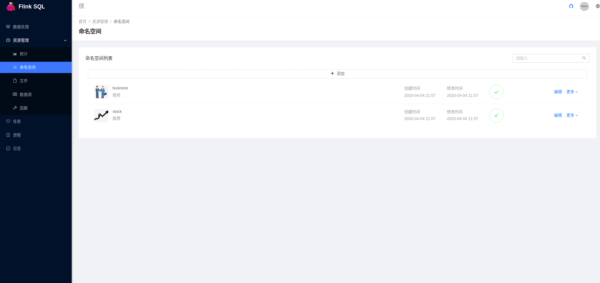
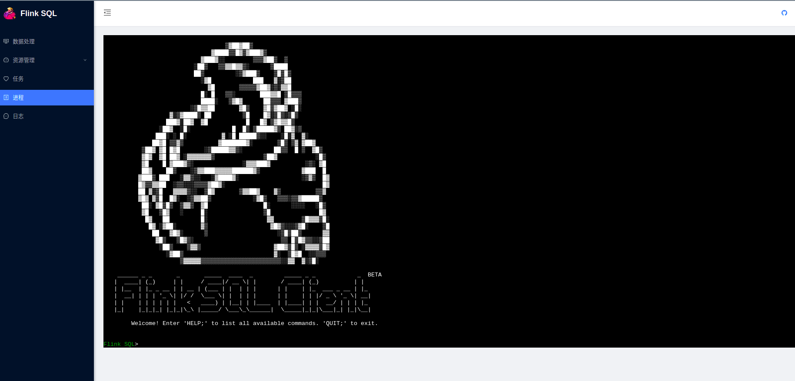

# Flink SQL 管理平台

> 基于Flink SQL Client 管理SQL任务并提供实时调试功能

## 基于分支开发

- back-end 后端代码
- frontend 前端代码

## 效果展示

> 管理命名空间

> 编写实时SQL

> 实时动态调试SQL

## 支持功能

- 管理命名空间
- 管理数据源
- 管理SQL函数
- 管理SQL编写及发布
- 动态调试SQL任务

## TODO

- Flink集群任务总览
- SQL任务管理（当前可以通过Flink自带的管理界面管理）
